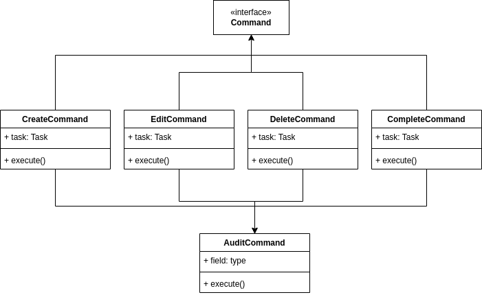

# Ejercicio 1
## Sistema de gestión de tareas

- **Contexto:**
Imagina un sistema de gestión de tareas en el que los usuarios pueden crear, editar, eliminar y completar tareas. Cada acción realizada por el usuario corresponde a una acción que debe ser ejecutado. Además, es importante mantener un registro de todas las acciones realizadas para permitir la reversión de las mismas si es necesario.

- **Aplicación del Patrón:**
En este escenario, el patrón será aplicado para encapsular cada una de las acciones que el usuario puede realizar sobre una tarea.
El patrón que seleccione debe tener los siguientes beneficios:
    * Desacopla el invocador de los objetos que realizan las acciones.
    * Permite la extensión de nuevas operaciones sin modificar el código existente.
    * Facilita el registro de acciones para realizar operaciones de reversión.

- **Solución:**
El patrón escogido para solucionar el problema es el **Command**

# Diagrama de clases
- 

# Como compilar
- Descargar el repositorio
- Ubicarse en la raíz del ejercicio 1 cd arqsoft_us_modulo2_js/src/ejercicio_1
- En la consola / terminal ejecutar el comando php index.php